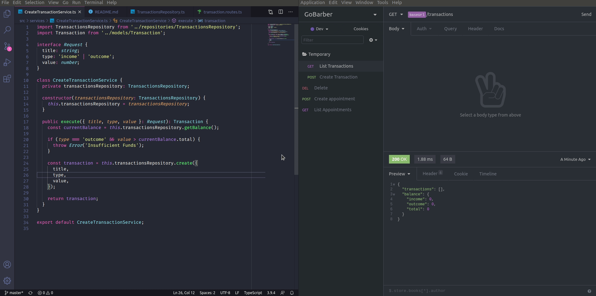
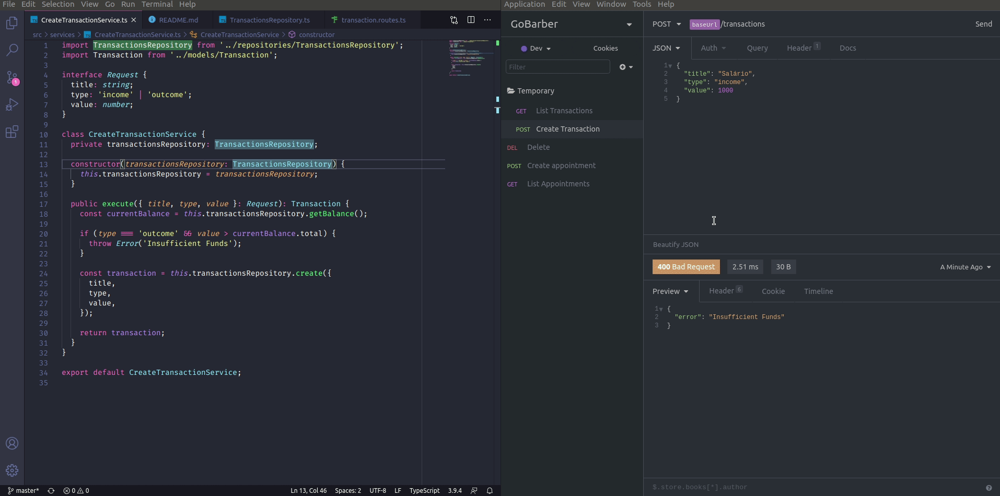
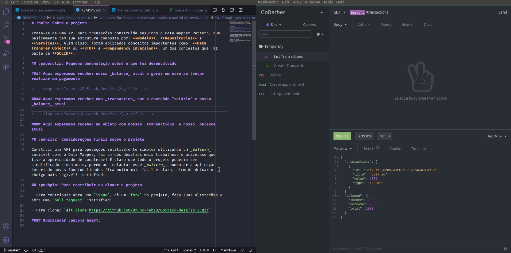

# :bulb: Sobre o projeto

Trata-se de uma API para transações construída seguindo o Data Mapper Pattern, que basicamente tem sua estrutura composta por: **Models**, **Repositories** e **Services**. Além disso, foram aplicados conceitos importantes como: **Data Transfer Object** ou **DTO** e **Dependency Inversion**, um dos conceitos que faz parte de **SOLID**.

## :paperclip: Pequena demonstação sobre o que foi desenvolvido

#### Aqui esperamos receber nosso _balance_ atual e gerar um erro ao tentar realizar um pagamento

#### Aqui esperamos receber uma _transaction_ com o conteúdo "salário" e nosso _balance_ atual

#### Aqui esperamos receber um objeto com nossas _transactions_ e nosso _balance_ atual

## :pencil2: Considerações finais sobre o projeto

Construir uma API para operações relativamente simples utilizando um _pattern_ incrível como o Data Mapper, foi um dos desafios mais trabalhoso e prazeroso que tive a oportunidade de completar! É claro que todo o projeto poderia ser simplificado ainda mais, porém ao implantar esse _pattern_, aumentar a aplicação inserindo novas funcionalidades fica muito mais fácil e claro, além de deixar o código mais legível! :satisfied:

## :pushpin: Para contribuir ou clonar o projeto

- Para contribuir abra uma `issue`, dê um `fork` no projeto, faça suas alterações e abra uma `pull request` :satisfied:

- Para clonar `git clone https://github.com/Bruno-hub19/GoStack-desafio-2.git`

#### #boracodar :purple_heart:
